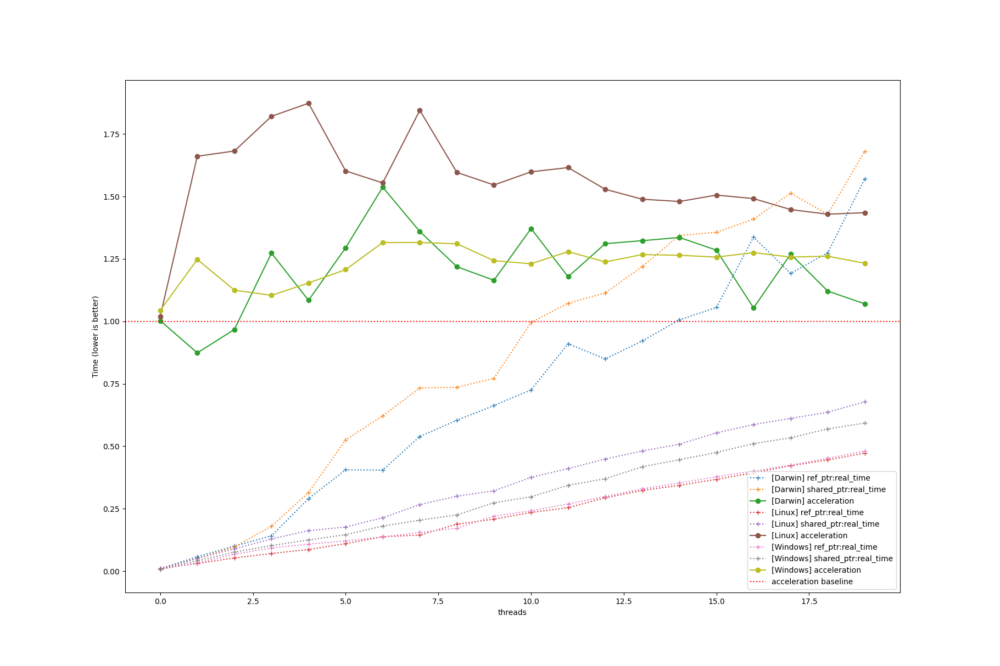

# An implementation of intrusive smart pointer with weak reference support.

## Features:
- Intrusive smart pointer with weak reference support.
- Reference counting is thread-safe.
- Efficient and minimal overhead than ```shared_ptr```

## Usage:

Copy ```ref.h``` in your include directory

```cpp

#include "ref.h"

class Alloc { // customized allocator
public:
  void dealloc(void *ptr) { delete ptr[]; }
  void *alloc(size_t size) { return new char[size]; }
};

// 1. define your base class
class IObject {
  virtual void foo() = 0;
};

// 2. place the default-implemented reference counter into your base class
class CountedAbstractObject : public RefCountedObject<IObject> {
public:
  //  define the constructor for  initiating forward ref counter object to base
  //  class.
  CountedAbstractObject(IRefCnt<IObject> *cnt)
      : RefCountedObject<IObject>(static_cast<refcnt_type *>(cnt)) {}
};

// 3. Derive your class as normal, AbstractObject is still the base class of
// DerivedObject
class DerivedObject : public CountedAbstractObject {

public:
  DerivedObject(refcnt_type *cnt) : CountedAbstractObject(cnt) {}
  void foo() override { std::cout << "Foo\n"; }
};

// Optional: define helper function for allocating the object
template <typename T, typename... Args> inline T *make_ptr(Args &&...args) {
  return vm_make<T, IObject, Alloc>(nullptr, std::forward<Args>(args)...);
}

template <typename T, typename... Args>
inline ref_ptr<T> make_ref(Args &&...args) {
  return make_ptr<T>(std::forward<Args>(args)...);
}

int main() {
  ref_ptr<DerivedObject> a = make_ptr<DerivedObject>();
  return 0;
}

```